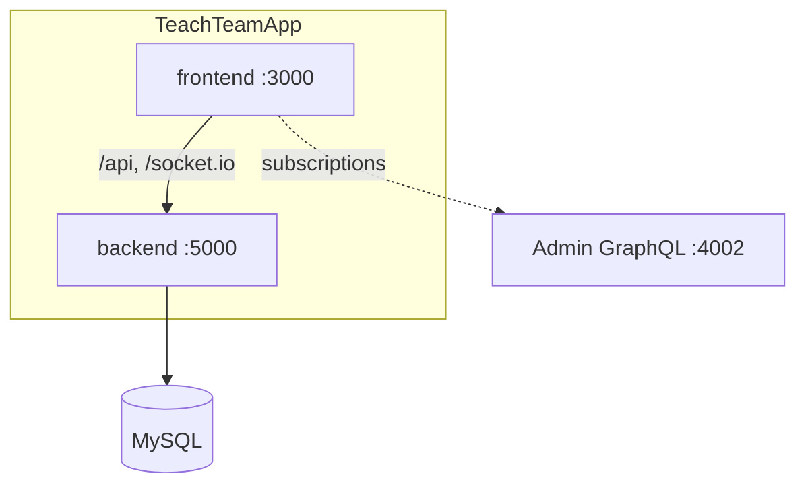
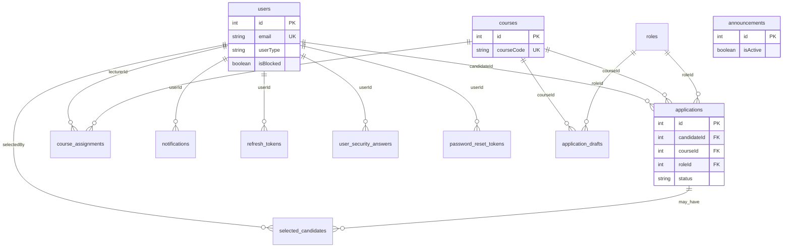

# TeachTeamApp

Main web application for **candidates** and **lecturers** in a university Tutor / Lab Assistant hiring system. The **admin CMS** lives in a separate repo: [TeachTeamApp-Admin](../TeachTeamApp-Admin/).

---

## Overview

| Role | Features |
|------|----------|
| **Candidate** | Browse courses, submit applications, track status, chat with lecturers, notifications |
| **Lecturer** | Review applications, filter/sort/paginate, shortlist, rank, select candidates, realtime chat |
| **Auth** | Email-domain signup, security-question password reset, change password, avatar upload |

**Default ports:** frontend `3000`, backend `5000`

---

## Tech stack

| Layer | Path | Technologies |
|-------|------|--------------|
| Frontend | `frontend/` | Next.js 15, React 19, Tailwind CSS 4, Axios, Socket.IO, Apollo (admin subscriptions) |
| Backend | `backend/` | Express 5, TypeORM, MySQL, JWT + refresh cookie, Socket.IO, node-cron email queue |
| Database | — | MySQL 8, TypeORM migrations (`backend/src/migrations/`) |

---

## Project structure

```
TeachTeamApp/
├── .env                 # copy from env.example (do not commit)
├── env.example
├── package.json         # root scripts: install, dev, build, db:reset
├── frontend/            # Next.js user app (:3000)
│   └── src/
│       ├── app/         # routes: /tutor, /lecturer, /profile, auth
│       ├── modules/     # auth, lecturer, tutor, profile
│       └── shared/      # contexts, services, hooks, components
└── backend/             # REST API (:5000)
    └── src/
        ├── routes/
        ├── controllers/
        ├── services/
        ├── entities/
        ├── migrations/
        └── seeds/
```

---

## Architecture



**Next.js rewrites** (`frontend/next.config.js`):

| Path | Target |
|------|--------|
| `/api/*` | Main backend |
| `/socket.io/*` | Main backend |
| `/admin-graphql` | Admin GraphQL (lecturer subscriptions) |
| `/uploads/*` | Static avatars |

**Backend layers:** Routes → Middleware (auth, rate limit, validation) → Controllers → Services → TypeORM.

---

## Database (ERD)



**12 tables:** `users`, `courses`, `roles`, `course_assignments`, `applications`, `application_drafts`, `selected_candidates`, `announcements`, `notifications`, `refresh_tokens`, `password_reset_tokens`, `user_security_answers`.

**Migrations:**
1. `1749200000000-InitialBaseline.ts`
2. `1749200001000-AddListPerformanceIndexes.ts`
3. `1749200002000-AddApplicationReviewForeignKey.ts`

---

## Environment variables

```bash
cp env.example .env
```

Both `frontend/` and `backend/` read **`.env` at this repo root**.

| Group | Variables |
|-------|-----------|
| Database | `DB_HOST`, `DB_PORT`, `DB_USERNAME`, `DB_PASSWORD`, `DB_NAME` |
| API | `BACKEND_PORT=5000`, `BACKEND_JWT_SECRET` |
| Admin seed | `ADMIN_EMAIL`, `ADMIN_PASSWORD` |
| CORS | `ALLOWED_ORIGINS`, `FRONTEND_URL` |
| Frontend (public) | `NEXT_PUBLIC_API_ENDPOINT=/api`, `NEXT_PUBLIC_SOCKET_URL`, `NEXT_PUBLIC_ADMIN_GRAPHQL_ENDPOINT` |
| Rewrite targets | `MAIN_API_ORIGIN`, `ADMIN_GRAPHQL_ORIGIN` |

See [env.example](./env.example) for the full list.

---

## Getting started

**Requirements:** Node.js 20+, MySQL 8+

```bash
# Install dependencies
npm install

# Create schema + seed demo data (first run)
npm run db:reset

# Development
npm run dev:windows    # Windows
npm run dev:unix       # macOS / Linux

# Production
npm run build
npm run start:windows  # or start:unix
```

**Backend only:**

```bash
cd backend
npm run dev
npm run migration:run
```

**Frontend only:**

```bash
cd frontend
npm run dev
```

| Service | URL |
|---------|-----|
| User app | http://localhost:3000 |
| API health | http://localhost:5000/health |

---

## Demo accounts

Run `npm run db:reset` before signing in.

| Role | Email | Password | Notes |
|------|-------|----------|-------|
| Lecturer | `jane.lecturer@lecturer.edu.au` | `Password123!` | `/lecturer` |
| Lecturer | `marcus.lecturer@lecturer.edu.au` | `Password123!` | |
| Candidate | `alex.candidate@candidate.edu.au` | `Password123!` | `/tutor` |
| Candidate | `sam.candidate@candidate.edu.au` | `Password123!` | |
| Candidate (blocked) | `taylor.candidate@candidate.edu.au` | `Password123!` | Test unblock in admin |
| Admin | `admin@admin.com` | `admin` | Login at http://localhost:3001 (admin repo) |

**Signup:** only `@candidate.edu.au` or `@lecturer.edu.au` (admin cannot register via REST).

**Forgot password** (all seeded users — security questions):

| Question | Answer |
|----------|--------|
| What city were you born in? | Melbourne |
| What was the name of your first school? | Demo School |
| What is your favorite book? | TeachTeam Guide |
| What was your childhood nickname? | Demo |

---

## Main routes (frontend)

| Path | Role |
|------|------|
| `/signin`, `/signup` | Guest |
| `/forgot-password`, `/reset-password` | Guest |
| `/tutor` | Candidate — browse & apply |
| `/tutor/applications` | Candidate — my applications |
| `/lecturer` | Lecturer — application dashboard |
| `/profile` | Authenticated — profile, avatar, change password |

---

## REST API endpoints

**Base URL:** `http://localhost:5000`

### Health

| Method | Path |
|--------|------|
| GET | `/health` |

### Auth — `/api/auth`

| Method | Path | Auth | Description |
|--------|------|------|-------------|
| POST | `/signup` | — | Register (+ security answers) |
| POST | `/signin` | — | Sign in |
| POST | `/logout` | — | Sign out |
| POST | `/refresh` | cookie | Refresh access token |
| GET | `/security-questions` | — | List security questions |
| POST | `/forgot-password/challenge` | — | Start forgot-password flow |
| POST | `/forgot-password/verify` | — | Verify security answers |
| POST | `/reset-password` | — | Set new password (token) |
| GET | `/profile` | JWT | Profile + assigned courses |
| PUT | `/profile` | JWT | Update name, honorific |
| POST | `/change-password` | JWT | Change password |
| PATCH | `/theme` | JWT | dark / light |
| POST | `/avatar` | JWT | Upload avatar (multipart) |
| DELETE | `/avatar` | JWT | Remove avatar |

### Applications — `/api/applications`

| Method | Path | Role | Description |
|--------|------|------|-------------|
| POST | `/` | candidate | Create application |
| GET | `/my-applications` | candidate | My applications |
| GET | `/courses-and-roles` | candidate | Open courses & roles |
| PUT | `/:id/withdraw` | candidate | Withdraw |
| PUT | `/:id/candidate-response` | candidate | Reply to lecturer |
| POST | `/:id/offer-response` | candidate | Accept / decline offer |
| GET | `/lecturer` | lecturer | List applications (paginate, filter, sort) |
| GET | `/statistics` | lecturer | Dashboard stats |
| PUT | `/:id/status` | lecturer | Select / reject |
| POST / DELETE | `/:id/shortlist` | lecturer | Shortlist |
| POST / PUT / DELETE | `/:id/ranking` | lecturer | Ranking |
| POST / PUT / DELETE | `/:id/comment` | lecturer | Comments |
| GET / PUT | `/:id/lecturer-notes` | lecturer | Private notes |
| POST | `/:id/review` | lecturer | Mark reviewed |
| GET | `/lecturer-assigned-courses` | lecturer | Assigned courses |

### Other

| Prefix | Endpoints |
|--------|-----------|
| `/api/application-drafts` | CRUD drafts (candidate) |
| `/api/announcements/active` | Active announcements (JWT) |
| `/api/notifications` | List (paginated), read, delete |
| `/api/public/lecturers` | Public lecturer list |
| `/uploads/*` | Avatar files |
| `WS /socket.io` | Realtime application events |
