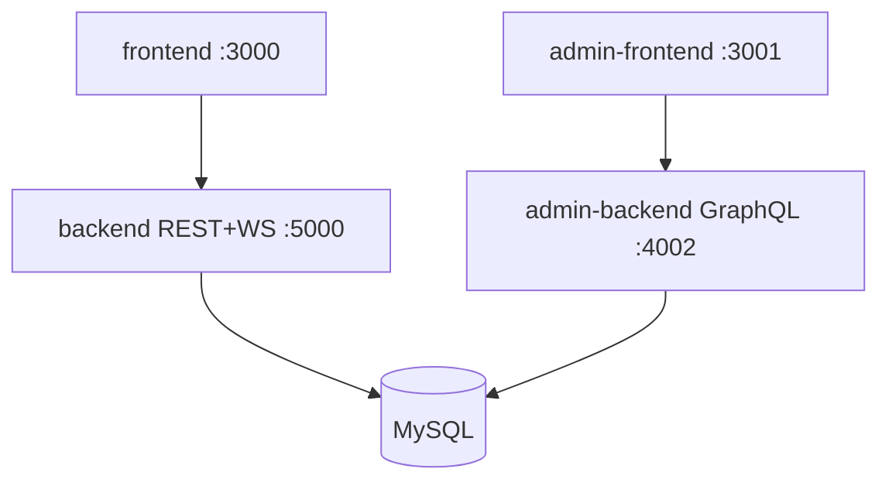
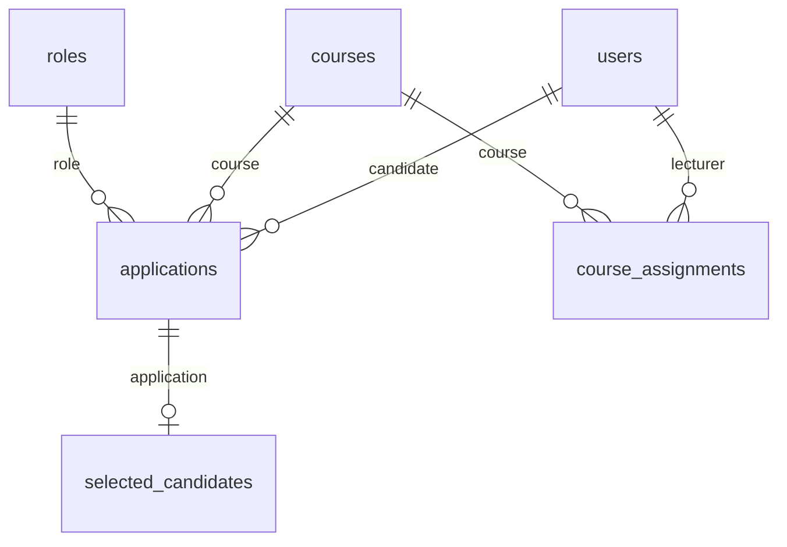

# TeachTeamApp — Project documentation (consolidated)

*Export PDF: `pandoc docs/CONSOLIDATED.md -o docs/TeachTeamApp-Documentation.pdf --toc`*

---

## 1. Project description

**TeachTeamApp** manages hiring for tutor and lab assistant roles: candidates (`@candidate.edu.au`) apply per course; lecturers (`@lecturer.edu.au`) review, comment, and rank; a **single admin** operates users, courses, and reports via a separate GraphQL panel.

**Stack:** Next.js 15, React 19, Express 5, TypeORM, MySQL, Apollo/TypeGraphQL, Socket.IO, JWT, optional SMTP for password reset.

---

## 2. Architecture



- REST auth on `/api/auth` (signin, signup, forgot/reset password).
- Admin: `adminLogin` mutation; no admin registration via REST.
- Realtime: Socket.IO (main app); GraphQL subscriptions (admin).

Details: `docs/architecture.md`.

---

## 3. ERD



**Tables:** `users`, `courses`, `roles`, `course_assignments`, `applications`, `selected_candidates`, `application_drafts`, `notifications`, `announcements`, `password_reset_tokens`.

Details: `docs/database-erd.md`.

---

## 4. Main API

### REST (`/api`)

| Group | Example endpoints |
|-------|-------------------|
| Health | `GET /health` |
| Public | `GET /api/public/lecturers` |
| Auth | `POST /api/auth/signin`, `signup`, `forgot-password`, `reset-password`, profile, avatar |
| Applications | `POST /`, `GET /my-applications`, `GET /lecturer`, status/comment/ranking |
| Drafts | `/api/application-drafts` |
| Notifications | `GET /`, `PUT /read-all` |
| Announcements | `GET /active` |

### Admin GraphQL

`adminLogin`, `getAllUsers`, `blockUser`, `getAllCourses`, `createCourse`, `assignLecturerToCourse`, report queries, announcement CRUD, subscriptions.

Details: `docs/api-reference.md`.

---

## 5. Demo accounts

After `cd backend && npm run db:reset`:

| Role | Email | Password |
|------|-------|----------|
| Admin | admin@admin.com | `ADMIN_PASSWORD` in `.env` (default `admin`) |
| Lecturer | jane.lecturer@lecturer.edu.au | Password123! |
| Candidate | alex.candidate@candidate.edu.au | Password123! |

---

## 6. Environment variables

Template: `env.example` at repo root. Groups: `DB_*`, `BACKEND_JWT_SECRET`, `ADMIN_*`, `SMTP_*`, `ALLOWED_ORIGINS`, `NEXT_PUBLIC_*`.

---

## 7. Run locally

```bash
npm run install && cp env.example .env
cd backend && npm run db:reset
npm run dev:windows
npm run dev:admin:windows
```

---

## 8. Deployment

**VPS (recommended):** Nginx + PM2 + MySQL — `deploy/vps/`, `docs/deployment.md`.

**Split cloud:** Vercel (`frontend/`) + Render (`backend/`) + managed MySQL.

---

## 9. Repository structure

```
frontend/  backend/  admin-frontend/  admin-backend/  docs/  deploy/vps/
```

---

*Documentation aligned with the current repository.*
