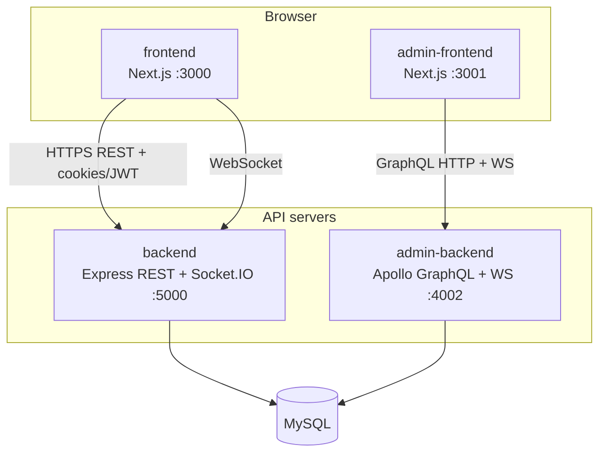
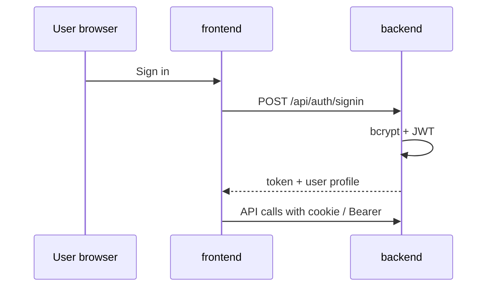
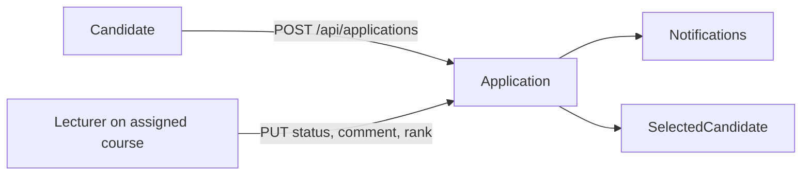

# System architecture — TeachTeamApp

## 1. Overview

TeachTeamApp is a **monorepo** with four applications and **one shared MySQL** database:

| Layer | Responsibility |
|-------|----------------|
| **frontend** | Candidate & lecturer UX; REST calls; realtime via Socket.IO |
| **backend** | Applications, JWT auth, avatar upload, notifications, password reset |
| **admin-frontend** | Manage users, courses, reports, announcements |
| **admin-backend** | GraphQL + subscriptions (block user, course events) |

Admin does **not** sign in through the main REST app; the main backend **blocks** admin signup/signin on public routes.

---

## 2. Authentication flow

- JWT stored client-side per frontend implementation (httpOnly cookie supported).
- Middleware `authenticateToken` + `requireUserType` on REST routes.
- Admin: `adminLogin` mutation → admin JWT → resolver guards.
- Password reset: `POST /api/auth/forgot-password` → email or dev link → `POST /api/auth/reset-password`.

---

## 3. Application flow (REST)

- One application per (candidate + course + role) — unique DB index.
- Lecturers only access applications for their **course_assignments**.
- `maxTutors` / `maxLabAssistants` on `courses` cap selections.

---

## 4. Realtime (Socket.IO)

- Server: `backend/src/socket/socketServer.ts`, same HTTP port as REST.
- Client: `NEXT_PUBLIC_SOCKET_URL` (usually the API origin).
- Events: account blocked, application updates for assigned lecturers.

Admin uses **GraphQL subscriptions** on admin-backend for operational events.

---

## 5. CORS & environment

- `ALLOWED_ORIGINS`: comma-separated frontend origins.
- `credentials: true` — cross-origin cookies require an exact origin match.
- Production VPS: Nginx terminates TLS and proxies `/api` and `/socket.io` to the backend.

---

## 6. Seed & database operations

- TypeORM `synchronize: true` in dev/demo; use migrations in production when possible.
- Seed: `cd backend && npm run db:reset` → `DatabaseResetService` + `bootstrapDataset.ts`.
- Server does **not** auto-seed on every start (avoids overwriting production data).

---

## 7. Deployment reference

| Model | Description |
|-------|-------------|
| **VPS all-in-one** | Nginx → PM2 (4 processes) + local MySQL — [deployment.md](./deployment.md) |
| **Split cloud** | Vercel (frontend) + Render (backend) + managed DB |

Production env template: `deploy/vps/env.production.example`.
